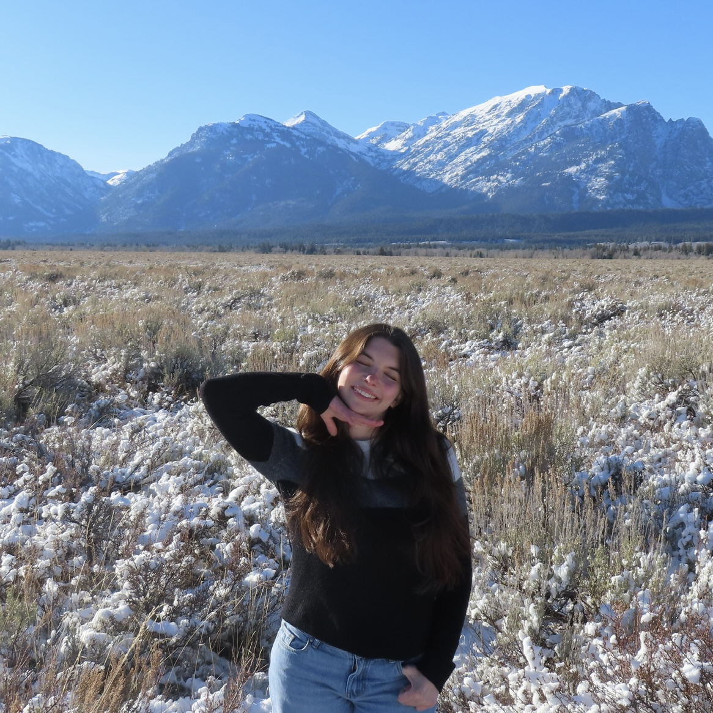

<!-- HOME: replace the name, introduction, and email below. Keep the ::: layout lines. -->
:::: {.home-hero}
::: {.hero-copy}
[POLITICAL SCIENCE | WOMEN'S & GENDER STUDIES | DATA ANALYTICS]{.eyebrow}

# Madison Hayward {.display-name}

[Quantifying political and social dynamics]{.hero-subtitle}

Analyzing politics, power, and society through quantitative data and critical theory.

[Explore my research](research.qmd){.primary-link} [Say hello](mailto:mahywar2@lion.lmu.edu){.quiet-link}
:::

::: {.hero-photo}
<!-- Replace images/profile.jpg with your photo. Update the description in fig-alt too. -->
{fig-alt="Orange flowers, a sample image for this personal website."}
:::
::::

:::: {.home-notes}
::: {.home-note}
[01 / IN THE CLASSROOM]{.eyebrow}

## Questions worth asking

How do the places we live shape our opportunities? I'm learning to turn broad questions into small, careful research projects.

[Academic interests & research](research.qmd)
:::

::: {.home-note}
[02 / BEYOND THE CLASSROOM]{.eyebrow}

## Learning by noticing

A new place, a good conversation, or a surprising chart can be the start of an idea. I keep those observations in my blog.

[Read my latest notes](blog.qmd)
:::
::::
